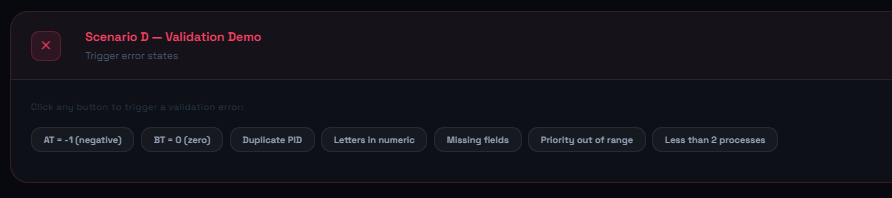
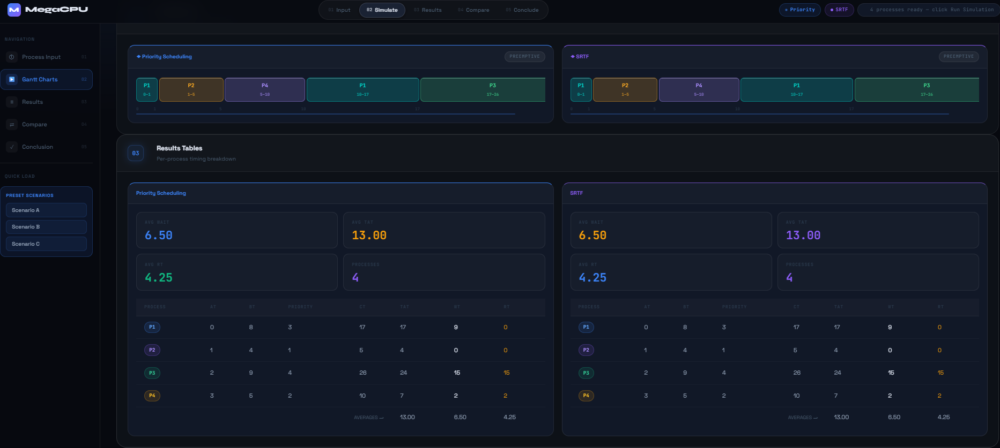
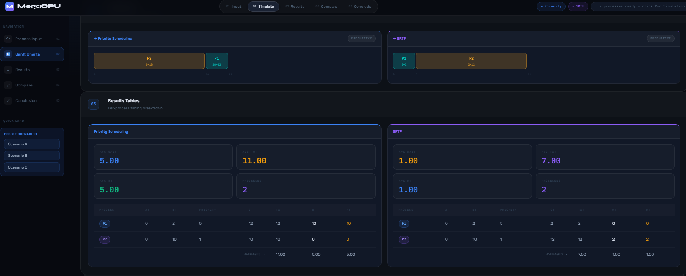
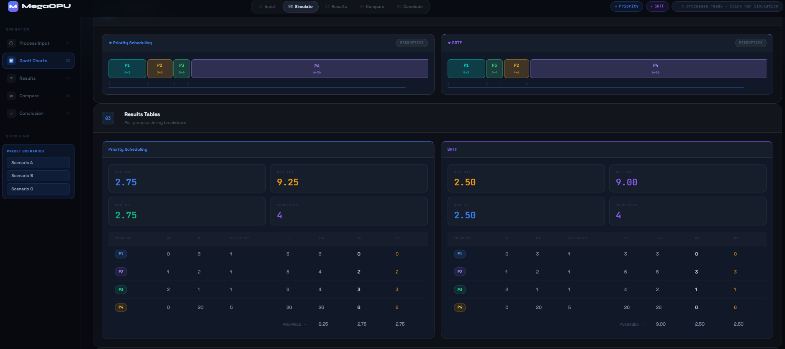

# CPU Scheduling Simulator

An interactive, browser-based educational tool that simulates and compares two classic preemptive CPU scheduling algorithms: **Preemptive Priority Scheduling** and **SRTF (Shortest Remaining Time First)**.

> **Course:** Operating Systems

---

## Team Members

| No. | Student Name                  | Student ID |
| --- | ----------------------------- | ---------- |
| 1   | طارق محمد احمد ابراهيم عربان  | 20240497   |
| 2   | عبادة مصطفي محمود علي الغول   | 20240507   |
| 3   | عبدالرحمن ابو الفضل قاسم محمد | 20240513   |
| 4   | عبدالرحمن رجب السيد ابراهيم   | 20240535   |
| 5   | عمر عاطف حسن محمد             | 20240633   |
| 6   | عمر محمود رمضان محمد          | 20240654   |
| 7   | عمر محمود محمد محمود محمد     | 20240655   |

---

## 📋 Table of Contents

- [Overview](#overview)
- [Features](#features)
- [Project Architecture](#project-architecture)
- [Requirements](#requirements)
- [Algorithms](#algorithms)
- [Metrics](#metrics)
- [Input Validation](#input-validation)
- [Scenarios](#scenarios)
- [Algorithm Comparison](#algorithm-comparison)
- [Technologies](#technologies)
- [Conclusion](#conclusion)

---

# Overview

The CPU Scheduling Simulator runs entirely in the browser without external dependencies or build tools. It allows users to enter custom processes or load predefined scenarios, then visualize how different CPU scheduling algorithms behave using detailed Gantt charts and performance metrics.

The simulator compares:

- **Preemptive Priority Scheduling**
- **SRTF (Shortest Remaining Time First)**

Both algorithms are implemented completely in JavaScript and executed dynamically in the browser.

---

# Features

- Manual process input
- Full validation system
- Side-by-side algorithm comparison
- Interactive Gantt charts
- Detailed metrics tables
- Automatic averages calculation
- Predefined educational scenarios
- Reset functionality
- Responsive dark UI
- Written analysis generation

---

# Project Architecture

The project is divided into independent layers for maintainability and scalability.

| File        | Responsibility                                    |
| ----------- | ------------------------------------------------- |
| `logic.js`  | Scheduling algorithms and calculations            |
| `script.js` | UI logic, rendering, validation, and DOM handling |
| `style.css` | Styling and responsive design                     |

---

# Requirements

- Modern web browser
- No installations required
- No dependencies
- No package managers
- No internet connection required after cloning

Supported browsers:

- Chrome 90+
- Firefox 88+
- Edge 90+
- Safari 14+

---

# Algorithms

## Preemptive Priority Scheduling

The CPU always selects the ready process with the highest priority.

Lower priority numbers indicate higher importance:

```text
Priority 1 > Priority 2 > Priority 3
```

If a new process arrives with higher priority, the currently running process is immediately preempted.

### Characteristics

| Property       | Description            |
| -------------- | ---------------------- |
| Type           | Preemptive             |
| Selection Rule | Lowest priority number |
| Tie Breaking   | Arrival Time → PID     |
| Main Goal      | Urgency handling       |
| Risk           | Starvation             |

---

## SRTF — Shortest Remaining Time First

SRTF always selects the process with the smallest remaining burst time.

Whenever a shorter process arrives, the current process is preempted immediately.

### Characteristics

| Property       | Description                    |
| -------------- | ------------------------------ |
| Type           | Preemptive                     |
| Selection Rule | Shortest remaining burst time  |
| Tie Breaking   | Remaining Time → Arrival → PID |
| Main Goal      | Minimize average waiting time  |
| Risk           | Starvation                     |

---

# Metrics

| Metric | Formula             | Meaning               |
| ------ | ------------------- | --------------------- |
| CT     | Completion Time     | Time process finishes |
| TAT    | CT − AT             | Turnaround Time       |
| WT     | TAT − BT            | Waiting Time          |
| RT     | First CPU Time − AT | Response Time         |

---

# Input Validation

The simulator validates all user inputs before execution.

| #   | Validation Rule                      |
| --- | ------------------------------------ |
| 1   | Arrival Time cannot be negative      |
| 2   | Burst Time must be greater than zero |
| 3   | Duplicate PIDs are not allowed       |
| 4   | Burst Time must be numeric           |
| 5   | All fields are required              |
| 6   | Priority must be between 1 and 99    |
| 7   | At least 2 processes are required    |

<p align="center">
  
</p>
---

# Scenarios

The simulator contains multiple educational scenarios specifically designed to demonstrate different scheduling behaviors and algorithmic trade-offs.

---

# Scenario A — Mixed Workload

## Objective

This scenario represents a realistic mixed CPU workload where:

- Processes arrive at different times
- Burst times vary significantly
- Priorities are different

The purpose is to test:

- Preemption correctness
- Queue handling
- Metric calculations
- Tie-breaking behavior

---

## Input

| Process | AT  | BT  | Priority |
| ------- | --- | --- | -------- |
| P1      | 0   | 8   | 3        |
| P2      | 1   | 4   | 1        |
| P3      | 2   | 9   | 4        |
| P4      | 3   | 5   | 2        |

---

# Priority Scheduling Execution

## Time 0

Only P1 exists.

CPU executes:

```text
P1
```

Remaining:

```text
P1 = 7
```

---

## Time 1

P2 arrives:

```text
Priority(P2)=1
Priority(P1)=3
```

P2 has higher priority.

P1 is preempted immediately.

CPU switches to:

```text
P2
```

---

## Time 2

P3 arrives with:

```text
Priority(P3)=4
```

P2 still has the highest priority.

CPU continues executing P2.

---

## Time 3

P4 arrives:

```text
Priority(P4)=2
```

Still:

```text
Priority(P2)=1
```

P2 keeps the CPU.

---

## Time 5

P2 finishes.

Ready queue:

```text
P1 (Priority 3)
P3 (Priority 4)
P4 (Priority 2)
```

Highest priority:

```text
P4
```

CPU executes P4.

---

## Time 10

P4 finishes.

Remaining:

```text
P1
P3
```

P1 has higher priority.

CPU executes P1.

---

## Time 17

P1 finishes.

Only P3 remains.

CPU executes P3 until completion.

---

## Final Gantt Chart

```text
| P1 | P2 | P4 | P1 | P3 |
0    1    5   10   17   26
```

---

# SRTF Execution

SRTF selects the process with the shortest remaining burst time.

---

## Time 0

Only P1 exists.

CPU executes:

```text
P1
```

Remaining:

```text
P1 = 7
```

---

## Time 1

P2 arrives:

```text
P1 = 7
P2 = 4
```

Since:

```text
4 < 7
```

P1 is preempted.

CPU executes P2.

---

## Time 2

P3 arrives:

```text
P3 = 9
```

P2 still has the shortest remaining time.

---

## Time 3

P4 arrives:

```text
P4 = 5
P2 remaining = 2
```

P2 keeps running.

---

## Time 5

P2 completes.

Remaining:

```text
P1 = 7
P3 = 9
P4 = 5
```

Shortest process:

```text
P4
```

---

## Time 10

P4 finishes.

Remaining:

```text
P1 = 7
P3 = 9
```

Shortest:

```text
P1
```

---

## Time 17

P1 finishes.

Only P3 remains.

CPU executes P3.

---

## Final Gantt Chart

```text
| P1 | P2 | P4 | P1 | P3 |
0    1    5   10   17   26
```

---

# Analysis

This scenario demonstrates a rare case where both algorithms produce identical schedules.

This happens because:

- Higher priority processes also happen to be shorter jobs
- No conflict exists between urgency and efficiency

As a result:

- Average WT is identical
- Average TAT is identical
- Average RT is identical

<p align="center">
  
</p>
---

# Scenario B — Priority vs Length Conflict

## Objective

This scenario demonstrates the conflict between:

- Priority
- Burst Time

It highlights the philosophical difference between the algorithms.

---

## Input

| Process | AT  | BT  | Priority |
| ------- | --- | --- | -------- |
| P1      | 0   | 2   | 5        |
| P2      | 0   | 10  | 1        |

---

# Priority Scheduling Behavior

At time 0:

```text
P1 priority = 5
P2 priority = 1
```

Priority Scheduling chooses:

```text
P2
```

even though P2 is much longer.

---

## Execution Timeline

```text
P2 executes from 0 → 10
P1 waits from 0 → 10
P1 executes from 10 → 12
```

---

## Gantt Chart

```text
| P2          | P1 |
0            10   12
```

---

## Observed Problem

P1 has:

```text
BT = 2
```

but waits:

```text
10 units
```

This significantly increases:

- Waiting Time
- Turnaround Time
- Response Time

---

# SRTF Behavior

At time 0:

```text
P1 = 2
P2 = 10
```

Shortest process:

```text
P1
```

CPU executes P1 immediately.

---

## Execution Timeline

```text
P1 executes from 0 → 2
P2 executes from 2 → 12
```

---

## Gantt Chart

```text
| P1 | P2          |
0    2            12
```

---

## Why SRTF Wins

SRTF minimizes average waiting time mathematically.

Short jobs finish early instead of waiting behind long jobs.

This dramatically improves:

- Average WT
- Average TAT
- Average RT

---

# Core Insight

Priority Scheduling optimizes:

```text
Urgency
```

SRTF optimizes:

```text
Efficiency
```

One focuses on policy.

The other focuses on mathematical optimization.

<p align="center">
  
</p>
---

# Scenario C — Starvation Risk

## Objective

This scenario demonstrates starvation.

Starvation occurs when a process waits for a very long time because other processes continuously receive the CPU first.

---

## Input

| Process | AT  | BT  | Priority |
| ------- | --- | --- | -------- |
| P1      | 0   | 1   | 1        |
| P2      | 1   | 1   | 1        |
| P3      | 2   | 1   | 1        |
| P4      | 0   | 20  | 5        |

---

# Priority Scheduling Analysis

At time 0:

```text
P1 priority = 1
P4 priority = 5
```

CPU executes:

```text
P1
```

---

## Time 1

P2 arrives:

```text
Priority(P2)=1
```

P2 executes before P4.

---

## Time 2

P3 arrives.

Again:

```text
Priority(P3)=1
```

P4 still waits.

---

## Time 3

Only after all short high-priority jobs finish can P4 finally execute.

---

## Gantt Chart

```text
| P1 | P2 | P3 | P4                  |
0    1    2    3                    23
```

---

# SRTF Analysis

SRTF ignores priorities completely.

Instead:

```text
Short jobs always win
```

At every scheduling decision:

```text
BT(short jobs)=1
BT(P4)=20
```

Therefore:

```text
P4 keeps waiting
```

until all short jobs finish.

---

# Important Observation

Even though the algorithms use different decision rules:

- Priority Scheduling favors urgency
- SRTF favors short jobs

they BOTH suffer from starvation.

---

# Why This Scenario Matters

This scenario proves that starvation is not tied to one specific scheduling policy.

Starvation appears whenever:

- Some processes are repeatedly favored
- Other processes continuously lose CPU access

---

# Aging — Common Solution

Modern operating systems solve starvation using:

```text
Aging
```

Aging gradually improves the priority of waiting processes over time.

Example:

```text
Every 5 time units:
Priority decreases by 1
```

Eventually:

```text
Long waiting processes become important enough to execute
```

This simulator intentionally does not implement aging so starvation remains visible for educational purposes.

<p align="center">
  
</p>
---

# Algorithm Comparison

| Aspect              | Priority Scheduling | SRTF                 |
| ------------------- | ------------------- | -------------------- |
| Main criterion      | Priority value      | Remaining burst time |
| Avg WT optimization | Not guaranteed      | Proven optimal       |
| Urgency support     | Strong              | Moderate             |
| Starvation cause    | Low priority        | Long burst time      |
| Ideal environment   | Real-time systems   | Batch systems        |

---

# Technologies

| Technology  | Role                  |
| ----------- | --------------------- |
| HTML5       | Structure             |
| CSS3        | Styling               |
| JavaScript  | Logic and interaction |
| `logic.js`  | Scheduling algorithms |
| `script.js` | Rendering and UI      |

---

# Conclusion

This simulator demonstrates how different scheduling algorithms make fundamentally different decisions under the same workload.

- Priority Scheduling focuses on urgency and responsiveness
- SRTF focuses on efficiency and average performance optimization

The project also demonstrates important operating system concepts including:

- Preemption
- Waiting time optimization
- Response time analysis
- Starvation
- Scheduling fairness

Through the included scenarios, users can clearly observe how workload characteristics directly influence scheduling behavior and overall system performance.
